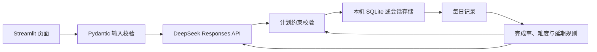

# 学习罗盘架构

## 数据流

## 两种运行模式

- **local**：计划、进度、复盘、无原始提示词的调用指标保存在本机 SQLite。每份计划有独立 ID。
- **demo**：每个浏览器会话有独立样例和记录。样例复盘只用确定性规则；真实生成必须先通过邀请码与共享数据库的每日额度检查。公开应用不会从本机 SQLite 读取其他人的计划。

## 重要约束

1. 原始计划必须与用户输入的周数、每周天数、单日分钟数匹配。
2. 每周复盘前，本周所有任务要有“已完成”或“延期”的最终状态；已复盘周次不能修改。
3. 后续计划只替换未开始的周次，延期任务确定性地放入下一周前面。
4. 任何模型结果在保存前再次通过 Pydantic 和时间上限校验。
5. 真实密钥只从运行环境读取，不存入计划、导出文件、评测报告或 Git。

## 当前边界

- 公开样例记录属于当前会话；使用 JSON 下载和导入跨会话继续。
- 评测框架提供 30 组固定输入与人工评分表；真实模型表现需运行评测后才能填写。
- 尚需项目仓库与 Streamlit Community Cloud 账号完成在线发布，并配置云端 Secrets；代码本身不含这些凭据。
